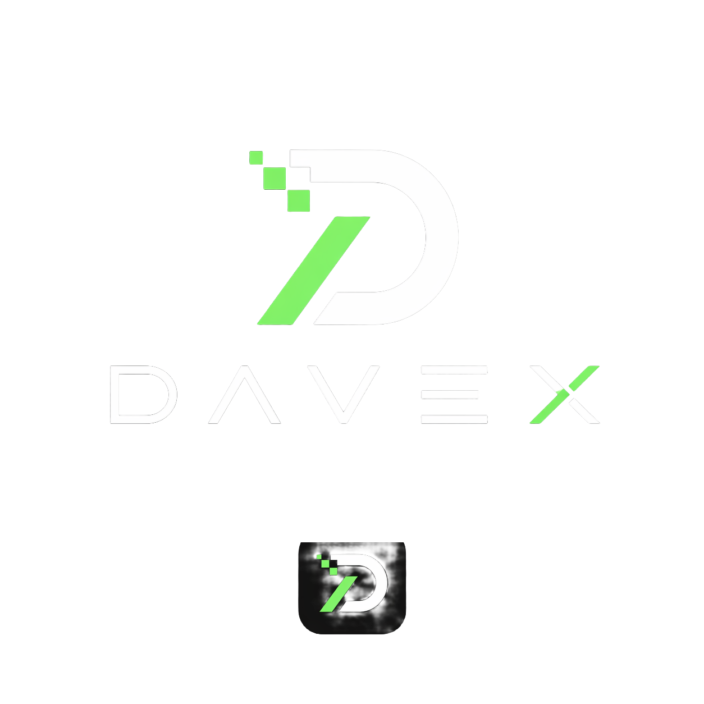

# DAVEX LMS - Enterprise Learning Management System



**IT Support. Solutions. Growth.**

A modern, enterprise-grade Learning Management System designed for practical ICT mentorship, competition, collaboration, and job-readiness training.

## 🚀 Features

### Core Features
- **Role-Based Access Control (RBAC)**: Super Admin, Admin, Instructor, Student
- **Secure Authentication**: JWT with refresh tokens, account activation, password reset
- **Realtime Communication**: Socket.io for chat, notifications, and live updates
- **Course Management**: Comprehensive lesson, topic, and resource management
- **Skill Battle Arena**: Competitive challenges with leaderboard rankings
- **Flash Prize System**: Realtime reward claiming with race-condition prevention
- **Premium Plans**: Basic and Premium tier system
- **Mobile-First Design**: Fully responsive across all devices
- **Dark/Light Mode**: Persistent theme switching

### Security Features
- OWASP best practices implementation
- NoSQL injection protection
- XSS sanitization
- CSRF protection
- Rate limiting and request throttling
- Secure password hashing with bcrypt
- Account lockout after failed attempts
- Comprehensive activity logging

### Student Features
- Personal dashboard with analytics
- Course enrollment and progress tracking
- Challenge submissions and evaluations
- Leaderboard rankings and badges
- Realtime announcements
- Session schedules
- Premium content access

### Instructor Features
- Course and lesson management
- Student progress monitoring
- Resource uploads
- Topic marking as covered
- Challenge creation and evaluation

### Admin Features
- User management (students, instructors)
- Course administration
- Challenge management
- Announcement system
- Flash prize creation
- Premium upgrades
- System analytics

## 🛠️ Tech Stack

### Frontend
- **Framework**: React.js with Vite
- **Styling**: Tailwind CSS
- **Animation**: Framer Motion
- **State Management**: Zustand
- **HTTP Client**: Axios
- **Realtime**: Socket.io Client
- **Charts**: Recharts
- **Icons**: Lucide React
- **Validation**: Zod
- **Notifications**: React Hot Toast

### Backend
- **Runtime**: Node.js
- **Framework**: Express.js
- **Database**: MongoDB with Mongoose ODM
- **Authentication**: JWT (jsonwebtoken)
- **Realtime**: Socket.io
- **Security**: Helmet, express-rate-limit, express-mongo-sanitize, xss-clean
- **Logging**: Winston with daily rotation
- **Validation**: Zod, express-validator
- **File Upload**: Multer

## 📁 Project Structure

```
DAVEX-LMS/
├── FRONTEND/
│   ├── public/
│   ├── src/
│   │   ├── api/              # Axios configuration
│   │   ├── assets/           # Static assets
│   │   ├── components/       # Reusable components
│   │   ├── contexts/         # React contexts
│   │   ├── hooks/            # Custom hooks
│   │   ├── layouts/          # Layout components
│   │   ├── pages/            # Page components
│   │   ├── routes/           # Routing configuration
│   │   ├── services/         # API services
│   │   ├── store/            # Zustand stores
│   │   ├── styles/           # Global styles
│   │   ├── utils/            # Utility functions
│   │   ├── validations/      # Validation schemas
│   │   └── main.jsx          # Entry point
│   ├── .env.example
│   ├── package.json
│   ├── vite.config.js
│   ├── tailwind.config.js
│   └── vercel.json
│
├── BACKEND/
│   ├── src/
│   │   ├── config/           # Configuration files
│   │   ├── controllers/      # Route controllers
│   │   ├── database/         # Database connection
│   │   ├── jobs/             # Background jobs
│   │   ├── logs/             # Log files
│   │   ├── middleware/       # Express middleware
│   │   ├── models/           # Mongoose models
│   │   ├── routes/           # API routes
│   │   ├── security/         # Security utilities
│   │   ├── services/         # Business logic
│   │   ├── sockets/          # Socket.io handlers
│   │   ├── uploads/          # File uploads
│   │   ├── utils/            # Utility functions
│   │   ├── validators/       # Input validators
│   │   ├── app.js            # Express app
│   │   └── server.js         # Server entry point
│   ├── .env.example
│   ├── package.json
│   └── render.yaml
│
├── .gitignore
├── README.md
└── LICENSE
```

## 🚀 Getting Started

### Prerequisites
- Node.js (v18 or higher)
- MongoDB Atlas account
- Git

### Backend Setup

1. **Navigate to backend directory**
   ```bash
   cd BACKEND
   ```

2. **Install dependencies**
   ```bash
   npm install
   ```

3. **Create environment file**
   ```bash
   cp .env.example .env
   ```

4. **Configure environment variables**
   Edit `.env` and add your MongoDB URI and JWT secrets:
   ```env
   PORT=5000
   NODE_ENV=development
   MONGO_URI=your_mongodb_atlas_connection_string
   JWT_SECRET=your_super_secure_jwt_secret_min_32_chars
   JWT_REFRESH_SECRET=your_super_secure_refresh_secret_min_32_chars
   CLIENT_URL=http://localhost:3000
   ```

5. **Start development server**
   ```bash
   npm run dev
   ```

   Backend will run on `http://localhost:5000`

### Frontend Setup

1. **Navigate to frontend directory**
   ```bash
   cd FRONTEND
   ```

2. **Install dependencies**
   ```bash
   npm install
   ```

3. **Create environment file**
   ```bash
   cp .env.example .env
   ```

4. **Configure environment variables**
   Edit `.env`:
   ```env
   VITE_API_BASE_URL=http://localhost:5000/api/v1
   VITE_SOCKET_URL=http://localhost:5000
   ```

5. **Start development server**
   ```bash
   npm run dev
   ```

   Frontend will run on `http://localhost:3000`

## 🌐 Deployment

### Frontend Deployment (Vercel)

1. **Install Vercel CLI**
   ```bash
   npm install -g vercel
   ```

2. **Deploy**
   ```bash
   cd FRONTEND
   vercel
   ```

3. **Set environment variables in Vercel dashboard**
   - `VITE_API_BASE_URL`: Your backend URL
   - `VITE_SOCKET_URL`: Your backend URL

### Backend Deployment (Render)

1. **Create new Web Service on Render**
2. **Connect your GitHub repository**
3. **Configure build settings**:
   - Build Command: `cd BACKEND && npm install`
   - Start Command: `cd BACKEND && npm start`
   - Root Directory: `/`

4. **Set environment variables**:
   - `NODE_ENV`: production
   - `MONGO_URI`: Your MongoDB Atlas connection string
   - `JWT_SECRET`: Generate secure secret
   - `JWT_REFRESH_SECRET`: Generate secure secret
   - `CLIENT_URL`: Your Vercel frontend URL

### Database Setup (MongoDB Atlas)

1. **Create MongoDB Atlas account**
2. **Create new cluster**
3. **Configure network access** (allow connections from anywhere for production)
4. **Create database user**
5. **Get connection string** and add to backend `.env`

## 🔐 Security Best Practices

### Environment Variables
- **NEVER** commit `.env` files to Git
- Use strong, randomly generated secrets (minimum 32 characters)
- Rotate secrets regularly in production

### Password Requirements
- Minimum 8 characters
- At least one uppercase letter
- At least one lowercase letter
- At least one number

### Rate Limiting
- Login attempts: 5 per 15 minutes
- Password reset: 3 per hour
- General API: 100 requests per 15 minutes
- Challenge submissions: 10 per minute

## 📚 API Documentation

### Base URL
```
Production: https://your-backend.onrender.com/api/v1
Development: http://localhost:5000/api/v1
```

### Authentication Endpoints
- `POST /auth/login` - User login
- `POST /auth/activate` - Account activation
- `POST /auth/password-reset/request` - Request password reset
- `POST /auth/password-reset/reset` - Reset password
- `POST /auth/refresh-token` - Refresh access token
- `POST /auth/logout` - Logout user
- `GET /auth/me` - Get current user

### Admin Endpoints
- `POST /admin/students` - Create student account
- `POST /admin/instructors` - Create instructor account
- `GET /admin/students` - Get all students
- `GET /admin/instructors` - Get all instructors
- `PATCH /admin/users/:userId/block` - Block user
- `PATCH /admin/users/:userId/unblock` - Unblock user
- `PATCH /admin/users/:userId/upgrade-premium` - Upgrade to premium
- `GET /admin/dashboard/stats` - Get dashboard statistics

### Course Endpoints
- `GET /courses` - Get all courses
- `GET /courses/:courseId` - Get course by ID
- `POST /courses` - Create course (Admin only)
- `PATCH /courses/:courseId` - Update course
- `POST /courses/:courseId/lessons` - Add lesson
- `POST /courses/:courseId/lessons/:lessonId/resources` - Add resource

### Challenge Endpoints
- `GET /challenges` - Get all challenges
- `GET /challenges/:challengeId` - Get challenge by ID
- `POST /challenges` - Create challenge
- `POST /challenges/:challengeId/submit` - Submit challenge
- `PATCH /challenges/:challengeId/submissions/:submissionId/evaluate` - Evaluate submission

## 🎨 Design System

### Colors
- **Primary**: Green (#22c55e)
- **Dark Background**: #030712 to #111827
- **Light Background**: #ffffff to #f9fafb

### Typography
- **Font Family**: System fonts (optimized for performance)
- **Headings**: Bold, various sizes
- **Body**: Regular weight

### Components
- Consistent border radius (8px, 12px, 16px)
- Shadow system (sm, md, lg, xl)
- Glow effects for premium features
- Smooth transitions (200ms)

## 🤝 Contributing

This is a production system. For contributions:
1. Fork the repository
2. Create feature branch
3. Follow existing code style
4. Write comprehensive tests
5. Submit pull request

## 📄 License

MIT License - See LICENSE file for details

## 👥 Support

For support and inquiries:
- Email: support@davex.com
- Documentation: [Link to docs]
- Issues: GitHub Issues

## 🙏 Acknowledgments

Built with modern web technologies and best practices for enterprise-grade applications.

---

**DAVEX LMS** - Empowering the next generation of ICT professionals through practical mentorship and real-world skill development.
